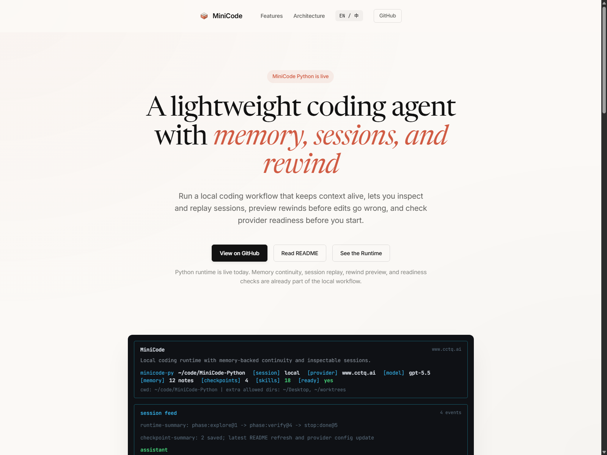
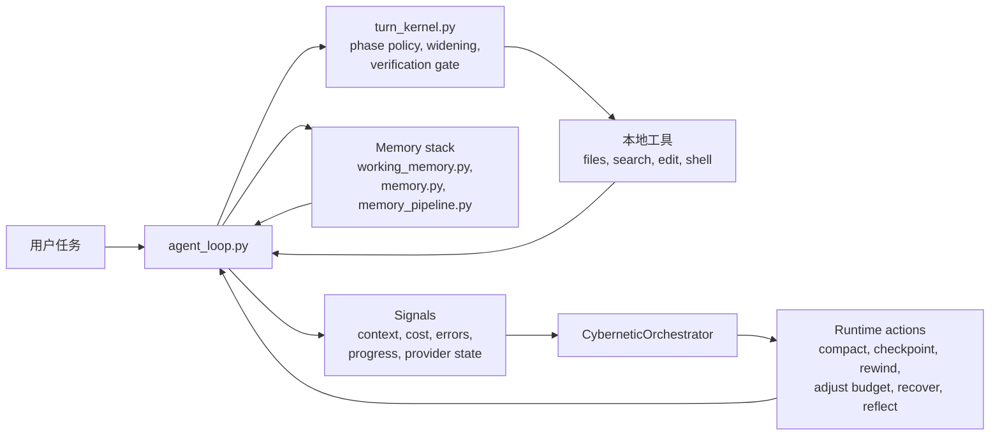

# MiniCode Python

<p align="center">
  <strong>一个面向本地开发的轻量级 coding agent：不只是聊天壳子，而是可恢复、可回放、可检查的终端工作流。</strong>
</p>

<p align="center">
  <a href="./README.md">English</a>
  |
  <a href="https://github.com/LiuMengxuan04/MiniCode">MiniCode 主仓库</a>
  |
  <a href="https://github.com/QUSETIONS/MiniCode-Python">Python 仓库</a>
</p>

<p align="center">
  
  
  
</p>

<p align="center">
  
</p>

<p align="center">
  <em>这不是示意图，而是真实的 MiniCode 前端 Demo：首页直接把 memory、session、rewind 和 readiness 作为一等产品能力展示出来。</em>
</p>

MiniCode Python 是 MiniCode 家族里的 Python 运行时。它面向真实的本地开发场景：agent 不只是能调模型和工具，还要能跨长会话保留状态、回看历史、撤销错误编辑，并把自己的运行状态说清楚。

如果把 Claude Code 看成成熟的终端 agent 产品体验，那么 MiniCode Python 更像它的轻量级、本地优先版本：更强调运行时透明性、可持续会话、记忆连续性、可回退编辑，以及可验证行为。

上面的截图来自真实的 MiniCode 前端 Demo。它想表达的是我们最看重的四件事：memory 让上下文不断线，session 可以 inspect 和 replay，rewind 让本地编辑更安全，readiness 能告诉你运行时是不是真的 ready。

## At a Glance

如果你想要的是下面这些体验，这个仓库就是给你的：

- 一个更像运行时而不是聊天窗口的终端 coding agent；
- 可 inspect、可 replay、可 resume、可总结的持久会话；
- 能保护工作上下文、并在需要时回注项目知识的记忆系统；
- 带 checkpoint、rewind preview 和恢复路径的安全本地编辑；
- 对 verification、widening、provider readiness 和失败原因都有显式信号。

如果只记住一句话，可以记这个：

> MiniCode Python 的核心目标是本地可信度：你应该能看清它做了什么、把改动撤回来，也能理解它为什么停在这里。

## Why This Repo Exists

很多 coding-agent README 会先讲模型接入和功能清单。MiniCode Python 想解决的是另一类问题：

> 运行时应该是可观察、可恢复、可测试的，而不只是“聪明”。

这会直接改变产品优先级：

| 优先级 | 在这个仓库里的含义 |
| --- | --- |
| Session-first | 会话可以 inspect、replay、resume 和 summary。 |
| Recovery-first | 文件编辑默认带 checkpoint、可 preview、可 rewind。 |
| Runtime-first | widening、verification、compaction 和 stop reason 都是显式的。 |
| Local-first | agent 围绕真实仓库、本地工具和终端工作流构建。 |

## Why MiniCode Python

| 维度 | MiniCode Python 的侧重点 |
| --- | --- |
| Durable sessions | 可以用本地命令 inspect、replay、resume 和 summary 当前或已保存会话。 |
| Memory as a first-class system | 保护活跃任务上下文、回注项目知识、在压缩时保持记忆感知、并持续沉淀有价值反思。 |
| Safe recovery | 自动 checkpoint、rewind preview、rewind safety group，以及 saved-session rewind。 |
| Runtime control | `single` / `single-deep` profile、phase-aware 执行、widening、verification gate 和结构化 stop reason。 |
| Observable behavior | runtime timeline、readiness report、provider 诊断、transcript summary 和 benchmark artifact。 |
| Local product surface | CLI/TUI 命令已经包括 `/session`、`/session-replay`、`/memory`、`/checkpoints`、`/rewind`、`/readiness`。 |
| Verifiable implementation | 根包由活跃测试套件兜底，不是“文档先行”的空壳。 |

## What You Can Do Today

以当前仓库状态，你已经可以：

- 用 `minicode-py` 跑交互式终端 agent；
- 用 `minicode-headless` 跑单次命令；
- 用 `/session` 查看当前会话快照；
- 用 `/sessions` 浏览当前工作区历史会话；
- 用 `/session-replay` 回放会话；
- 用 `/memory` 查看记忆层状态；
- 用 `/checkpoints` 查看 checkpoint 历史；
- 用 `/rewind-preview` 和 `/rewind` 预演或执行回退；
- 用 `/readiness` 检查 provider 和 fallback 是否就绪。

## 3-Minute Demo

### 0. 你需要什么

- Python 3.11+
- Windows、macOS 或 Linux 上的本地终端
- 如果要真实跑模型，需要可用的 provider/model 凭据

### 1. 安装并启动

```bash
git clone https://github.com/QUSETIONS/MiniCode-Python.git
cd MiniCode-Python
python -m pip install -e .[dev]
minicode-py
```

### 2. 让它做一个真实仓库任务

```text
Explain this repository and tell me which commands matter most for day-to-day use.
```

这里你应该看到标准的 MiniCode 工作流：先读仓库、解释发现，再让你 inspect、replay 或继续会话。

### 3. 检查运行时在做什么

```text
/session
/memory
/readiness
```

### 4. 需要时回放或恢复

```text
/session-replay
/checkpoints
/rewind-preview
```

### 5. 跑一次 headless 单轮模式

```bash
minicode-headless "Explain what this repo does."
```

## Typical Workflow


核心点很简单：MiniCode Python 不想把运行时藏起来。它让你看见工作过程、检查状态，并在出错时直接恢复，而不是自己手工善后。

这套思路同样适用于 memory：活跃任务上下文会被保护，耐久项目知识会在需要时回注，compaction 也可以利用记忆而不是盲目丢上下文。

## Everyday Commands

如果一开始只记六个命令，先记这几个：`/session`、`/sessions`、`/session-replay`、`/memory`、`/rewind-preview`、`/readiness`。

| 命令 | 作用 |
| --- | --- |
| `/session` | 查看当前 live session 快照。 |
| `/sessions` | 列出当前 workspace 的已保存会话。 |
| `/session-replay` | 回放当前或已保存会话，包括 transcript 和 runtime 上下文。 |
| `/memory` | 查看当前 workspace 的记忆系统状态。 |
| `/checkpoints` | 查看当前或已保存会话的 checkpoint 历史。 |
| `/rewind-preview` | 在真正改文件前，先看 rewind 会恢复什么。 |
| `/rewind` | 按最新 edit group、步数或 checkpoint id 执行回退。 |
| `/readiness` | 检查 runtime/provider readiness、fallback coverage 和产品面状态。 |

## Current Status

这个仓库已经过了纯 prototype 阶段。它现在更像一个可用的本地产品，但仍在继续朝“更成熟的轻量级 Claude Code 体验”收紧。

当前生效的主包是根目录 `minicode/`，由 `pyproject.toml` 里的 `minicode-py` 配置驱动。

最近一次本地验证结果：

```text
1030 passed, 2 skipped, 3 warnings
```

验证命令：

```bash
python -m compileall -q minicode py-src\minicode tests
pytest -q
```

实话实说，当前状态是：

- runtime、session、replay、checkpoint、rewind、readiness 这些产品面已经比较稳；
- memory 不是外挂：working memory、project memory、memory injection 和 memory-aware compaction 已经进了主运行路径；
- provider 和 fallback 诊断已经比以前清楚很多；
- 真实 provider 是否可用，仍然取决于你本地的凭据和通道配置；
- 这个项目今天已经能用，但还在继续往更完整的轻量级 Claude Code 体验走。

那 `3` 个 warning 是 benchmark 测试里未注册的 `pytest.mark.benchmark`，不是功能失败。

## Architecture



重点不是这张图本身，而是运行时状态在这里是显式对象：

- loop 可以 widen，而不是静默卡死；
- verification 可以拦住过早的 “done”；
- memory 可以保护任务关键上下文，并在需要时回注项目知识，而不是只依赖当前 chat window；
- session 状态可以跨进程存在；
- rewind 可以撤销本地编辑，而不是让你手工收拾残局；
- readiness 可以告诉你失败到底是本地逻辑还是 provider availability。

## Repository Guide

| 路径 | 作用 |
| --- | --- |
| `minicode/` | 安装和测试使用的规范 Python 包。 |
| `tests/` | 活跃测试套件。 |
| `benchmarks/` | runtime profile、release readiness runner 和生成报告。 |
| `docs/` | 架构说明、优化记录和产品化报告。 |
| `openspec/` | spec、归档变更记录，以及 build/verify 规划产物。 |
| `.mini-code-memory/` | runtime 创建的 workspace 级持久记忆状态。 |
| `py-src/minicode/` | 兼容与迁移镜像。 |

## Core Modules

| 模块 | 作用 |
| --- | --- |
| `minicode/agent_loop.py` | 主 model/tool loop、runtime event flow 和产品集成。 |
| `minicode/turn_kernel.py` | step policy、phase transition、widening 和 verification gate。 |
| `minicode/session.py` | durable session、inspect/replay 视图、checkpoint 和 rewind helper。 |
| `minicode/cli_commands.py` | `/session`、`/replay`、`/rewind`、`/readiness` 这类本地产品命令。 |
| `minicode/memory.py` | 长期项目记忆管理和检索入口。 |
| `minicode/working_memory.py` | 在 compaction 压力下仍会保留的 working memory 条目。 |
| `minicode/memory_pipeline.py` | memory retrieval、injection、reflection writeback 和优化闭环。 |
| `minicode/product_surfaces.py` | readiness、hooks、instructions、delegation、extensions 等用户可见摘要。 |
| `minicode/release_readiness.py` | 面向 release 的 runtime smoke 与 provider readiness 检查。 |
| `minicode/model_switcher.py` | 有界 fallback 和 failover 选择逻辑。 |
| `minicode/runtime_profiles.py` | `single`、`single-deep` 等 runtime profile。 |
| `minicode/cybernetic_orchestrator.py` | runtime control 生命周期总控。 |

## MiniCode Family

| 版本 | 仓库 | 侧重点 |
| --- | --- | --- |
| TypeScript | [LiuMengxuan04/MiniCode](https://github.com/LiuMengxuan04/MiniCode) | 主线终端 agent、TUI、MCP、skills、session 和 context control。 |
| Python | [QUSETIONS/MiniCode-Python](https://github.com/QUSETIONS/MiniCode-Python) | 本地优先的 Python runtime，强化了 session、rewind、readiness 和 observability。 |
| Rust | [harkerhand/MiniCode-rs](https://github.com/harkerhand/MiniCode-rs/tree/master) | 偏系统侧实现与实验。 |
| Java | [hobbescalvin414-tech/minicode4j](https://github.com/hobbescalvin414-tech/minicode4j/tree/feat/default-ts-ui) | Java 实现，沿着 TypeScript 风格 UI 方向演进。 |

## Documentation

如果你想继续看更深的实现与产品化记录，可以从这里开始：

- [English README](./README.md)
- [Optimization Summary](./docs/OPTIMIZATION_SUMMARY.md)
- [Memory Theory](./docs/memory_theory.md)
- [Minicode-lite Productization Design](./docs/superpowers/specs/2026-06-05-minicode-lite-productization-design.md)
- [Minicode-lite Build Plan](./docs/superpowers/plans/2026-06-05-minicode-lite-productization-build.md)
- [Minicode-lite Verify Report](./docs/superpowers/reports/2026-06-05-minicode-lite-productization-verify.md)
- [Main MiniCode Repository](https://github.com/LiuMengxuan04/MiniCode)

## Design Principles

- 让运行时保持可检查。
- 把 memory 当成可控的 runtime 子系统，而不是事后补丁。
- 用可测量信号替代“prompt 玄学”。
- 把恢复能力做成产品特性，而不是手工清理步骤。
- 把 verification 视为执行路径的一部分，而不只是汇报。
- 让文档描述已实现行为，而不是未来愿景。
