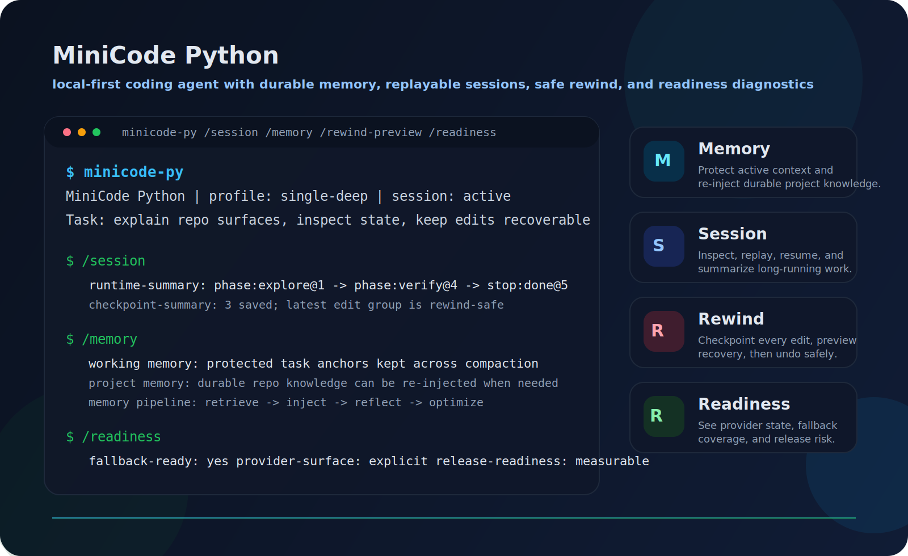
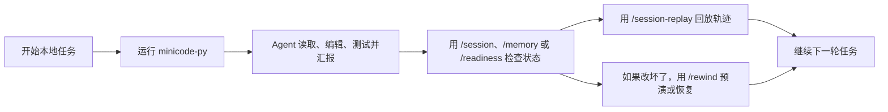
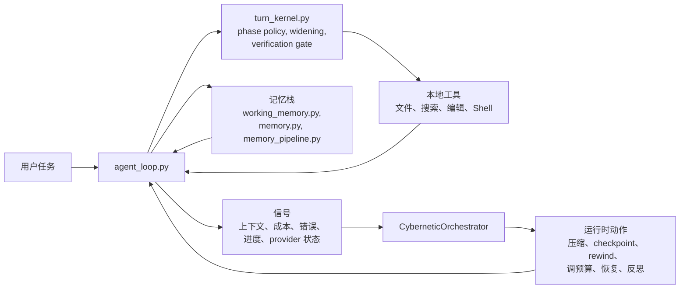

# MiniCode Python

<p align="center">
  <strong>一个面向本地开发的轻量级编码 Agent：不只是聊天壳子，而是可恢复、可回放、可检查的终端工作流。</strong>
</p>

<p align="center">
  <a href="./README.md">English</a>
  |
  <a href="https://github.com/LiuMengxuan04/MiniCode">MiniCode 主仓库</a>
  |
  <a href="https://github.com/QUSETIONS/MiniCode-Python">Python 仓库</a>
</p>

<p align="center">
  
  
  
</p>

<p align="center">
  
</p>

<p align="center">
  <em>Memory / Session / Rewind / Readiness：runtime 本身就是产品体验的一部分。</em>
</p>

MiniCode Python 是 MiniCode 家族里的 Python 实现。它面向真实本地仓库中的长期开发流程：Agent 不只要会调模型和工具，还要能保存会话、回看轨迹、回退错误编辑，并且把自己为什么继续、为什么验证、为什么停止说清楚。

如果要一句话概括，它更像一个“轻量级、本地优先、强调记忆连续性、可恢复性和可解释性”的 Claude Code 风格终端 Agent，而不是一个单纯的聊天式代码助手。

## 一眼看懂

如果你想要的是下面这些体验，那这个仓库就是给你的：

- 一个像运行时系统而不是聊天窗口的终端编码 Agent；
- 可以 inspect、replay、resume、做摘要的持久会话；
- 一套能保护工作上下文、也能回注项目知识的记忆系统；
- 带 checkpoint、rewind preview、恢复路径的安全本地编辑；
- 对 verification、widening、provider readiness、失败原因都有显式信号。

如果只记住一句话，可以记这个：

> MiniCode Python 的目标是本地可信度：你应该能看清它做了什么、把改动撤回来，也能理解它为什么停在这里。

## 为什么这个仓库存在

很多 Coding Agent 的 README 会先讲模型、演示和功能列表。MiniCode Python 想解决的是另一类问题：

> 一个编码 Agent 不应该只是“会调用工具”，还应该是可观察、可恢复、可验证的运行时系统。

这会直接改变产品重点：

| 优先级 | 在这个仓库里意味着什么 |
| --- | --- |
| Session-first | 会话可以 inspect、replay、resume，也可以做摘要。 |
| Recovery-first | 文件编辑是可 checkpoint、可预演、可 rewind 的。 |
| Runtime-first | widening、verification、compaction、stop reason 都是显式的。 |
| Local-first | 整套体验围绕真实本地仓库、本地工具和终端工作流构建。 |

## 为什么用 MiniCode Python

| 方向 | MiniCode Python 的重点 |
| --- | --- |
| 持久会话 | 可以 inspect、replay、resume、为当前或历史 session 做摘要，而不是只看一段聊天记录。 |
| 记忆是一等公民 | 保护当前任务上下文、在需要时回注项目知识、在 compaction 时保留关键信息，并把有价值的反思长期保存下来。 |
| 安全恢复 | 自动 checkpoint、rewind preview、rewind safety group、saved-session rewind。 |
| 运行时控制 | `single`、`single-deep`、phase-aware 执行、widening、verification gate、结构化 stop reason。 |
| 可观测性 | runtime timeline、readiness report、provider 诊断、transcript summary、benchmark artifact。 |
| 本地产品面 | CLI 和 TUI 里有 `/session`、`/session-replay`、`/memory`、`/checkpoints`、`/rewind`、`/readiness` 这些真实可用入口。 |
| 可验证实现 | 根包上有活跃测试集支撑，不是“文档里写了以后会有”。 |

## 现在已经能做什么

按当前仓库状态，你已经可以：

- 用 `minicode-py` 跑交互式终端 Agent；
- 用 `minicode-headless` 跑单次命令；
- 用 `/session` 查看当前 live session；
- 用 `/sessions` 浏览当前 workspace 的历史会话；
- 用 `/session-replay` 回放当前或已保存会话；
- 用 `/memory` 查看当前 workspace 的记忆系统状态；
- 用 `/checkpoints` 查看 checkpoint 历史；
- 用 `/rewind-preview` 和 `/rewind` 预演或执行回退；
- 用 `/readiness` 查看 provider、fallback 和产品面 readiness。

## 3 分钟上手

### 0. 你需要什么

- Python 3.11+
- 一个本地终端环境（Windows、macOS、Linux 都可以）
- 如果要真实调模型，需要准备 provider/model 凭据

### 1. 安装并启动

```bash
git clone https://github.com/QUSETIONS/MiniCode-Python.git
cd MiniCode-Python
python -m pip install -e .[dev]
minicode-py
```

### 2. 先让它在仓库里干一件真实的事

```text
Explain this repository and tell me which commands matter most for day-to-day use.
```

正常情况下，这一步就会进入它的真实工作循环：看仓库、整理结论、给出下一步，并留下可以继续 inspect、replay、继续执行的 session。

### 3. 立刻检查运行时状态

```text
/session
/memory
/readiness
```

### 4. 如果要回看或恢复

```text
/session-replay
/checkpoints
/rewind-preview
```

### 5. 需要单次无界面调用时

```bash
minicode-headless "Explain what this repo does."
```

## 典型工作流



真正重要的点很简单：MiniCode Python 不是想把运行时藏起来，而是让你能看到它、理解它、在它出错时把现场收回来。

这个思路同样适用于记忆系统：正在进行的任务上下文会被保护，持久化的项目知识可以在需要时回注，compaction 不是盲目丢弃，而是可以借助 memory 重用有用信息。

## 日常最重要的命令

如果你第一次用，先记住这 6 个：`/session`、`/sessions`、`/session-replay`、`/memory`、`/rewind-preview`、`/readiness`。

| 命令 | 作用 |
| --- | --- |
| `/session` | 查看当前 live session 快照。 |
| `/sessions` | 查看当前 workspace 下的已保存会话。 |
| `/session-replay` | 回放当前或历史会话，带 transcript 和 runtime 轨迹。 |
| `/memory` | 查看当前 workspace 的记忆系统状态。 |
| `/checkpoints` | 查看当前或历史 session 的 checkpoint 列表。 |
| `/rewind-preview` | 在真正改文件前先看 rewind 会恢复什么。 |
| `/rewind` | 按 latest、步数或 checkpoint id 回退文件修改。 |
| `/readiness` | 查看 runtime/provider readiness、fallback coverage 和产品面状态。 |

## 当前状态

这个仓库已经过了“原型演示”阶段，今天就是能拿来用的本地产品内核；只是离更完整、更顺手的轻量级 Claude Code 体验还有继续打磨空间。

当前有效包是 `pyproject.toml` 里配置的根包 `minicode-py`，也就是仓库根目录下的 `minicode/`。

当前本地验证结果：

```text
1030 passed, 2 skipped, 3 warnings
```

验证命令：

```bash
python -m compileall -q minicode py-src\minicode tests
pytest -q
```

比较诚实地说，当前状态是：

- 核心 runtime、session、replay、checkpoint、rewind、readiness 已经比较成型；
- 记忆不是后补功能；working memory、project memory、memory injection、memory-aware compaction 已经在真实 runtime 路径上；
- provider 和 fallback 诊断比以前清楚很多；
- 真正的 provider 可用性仍然取决于你本地的凭据和通道配置；
- 它今天已经可用，但还在继续朝“更完整的轻量级 Claude Code”打磨。

那 `3` 个 warning 是 benchmark 测试里未注册的 `pytest.mark.benchmark`，不是功能失败。

## 架构



真正重要的不是图，而是这套运行时的思想：

- 卡住时可以 widening，而不是悄悄空转；
- verification 可以拦住没有证据的“我做完了”；
- 记忆系统可以保护关键上下文、回注项目知识，而不是只依赖当前聊天窗口里的短上下文；
- session 可以跨进程活下来；
- rewind 可以把本地错误编辑撤回来；
- readiness 可以告诉你失败到底是本地逻辑问题，还是 provider availability 问题。

## 仓库导览

| 路径 | 作用 |
| --- | --- |
| `minicode/` | 安装和测试使用的 canonical Python 包。 |
| `tests/` | 当前有效测试集。 |
| `benchmarks/` | runtime profile 和 release readiness 的 runner 与结果产物。 |
| `docs/` | 架构说明、优化记录和产品化报告。 |
| `openspec/` | spec、归档 change、build 和 verify 规划产物。 |
| `.mini-code-memory/` | runtime 在 workspace 下面维护的持久记忆状态。 |
| `py-src/minicode/` | 兼容和迁移镜像目录。 |

## 核心模块

| 模块 | 作用 |
| --- | --- |
| `minicode/agent_loop.py` | 主模型、工具循环、runtime event 流和产品面接线。 |
| `minicode/turn_kernel.py` | step policy、phase 切换、widening 和 verification gate。 |
| `minicode/session.py` | durable session、inspect/replay、checkpoint 和 rewind helper。 |
| `minicode/cli_commands.py` | session、replay、rewind、memory、readiness 等本地产品命令。 |
| `minicode/memory.py` | 长期项目记忆管理和检索入口。 |
| `minicode/working_memory.py` | 在 compaction 压力下仍会被保护的 working memory。 |
| `minicode/memory_pipeline.py` | 闭环记忆检索、注入、reflection 回写和优化路径。 |
| `minicode/product_surfaces.py` | readiness、hooks、instructions、delegation、extensions 的用户侧摘要。 |
| `minicode/release_readiness.py` | 面向 release 的 runtime smoke 和 provider readiness 检查。 |
| `minicode/model_switcher.py` | 有边界的 fallback 和 failover 选择逻辑。 |
| `minicode/runtime_profiles.py` | `single`、`single-deep` 等 runtime profile 定义。 |
| `minicode/cybernetic_orchestrator.py` | 运行时控制生命周期 facade。 |

## MiniCode 家族

| 版本 | 仓库 | 重点 |
| --- | --- | --- |
| TypeScript | [LiuMengxuan04/MiniCode](https://github.com/LiuMengxuan04/MiniCode) | 主线终端 Agent、TUI、MCP、skills、sessions 和 context controls。 |
| Python | [QUSETIONS/MiniCode-Python](https://github.com/QUSETIONS/MiniCode-Python) | 本地优先的 Python runtime，更强调 session、memory、rewind、readiness 和可观测性。 |
| Rust | [harkerhand/MiniCode-rs](https://github.com/harkerhand/MiniCode-rs/tree/master) | 系统侧实现和实验。 |
| Java | [hobbescalvin414-tech/minicode4j](https://github.com/hobbescalvin414-tech/minicode4j/tree/feat/default-ts-ui) | Java 实现，沿用 TypeScript 风格 UI 方向。 |

## 文档

如果你想继续往实现细节、架构决策和产品化记录深挖，可以从这里开始：

- [English README](./README.md)
- [优化总结](./docs/OPTIMIZATION_SUMMARY.md)
- [记忆理论](./docs/memory_theory.md)
- [Minicode-lite Productization Design](./docs/superpowers/specs/2026-06-05-minicode-lite-productization-design.md)
- [Minicode-lite Build Plan](./docs/superpowers/plans/2026-06-05-minicode-lite-productization-build.md)
- [Minicode-lite Verify Report](./docs/superpowers/reports/2026-06-05-minicode-lite-productization-verify.md)
- [MiniCode 主仓库](https://github.com/LiuMengxuan04/MiniCode)

## 设计原则

- 让 runtime 保持可检查。
- 把记忆当成可控制的运行时子系统，而不是事后补上的功能。
- 优先依赖可测的运行时信号，而不是 prompt 玄学。
- 把恢复能力做成产品特性，而不是让用户自己善后。
- 把验证当作执行的一部分，而不是汇报的一部分。
- 文档只写当前真正实现的能力，不写空头愿景。
