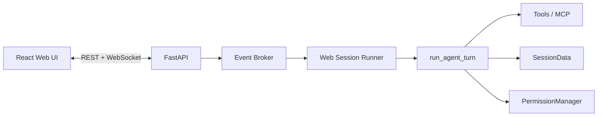

# MiniCode Python 本地 Web 前端一日开发任务书

| 项目 | 内容 |
|---|---|
| 文档日期 | 2026-06-19 |
| 计划执行日期 | 2026-06-19（一个工作日） |
| 任务编号 | MC-WEB-20260619 |
| 任务名称 | 本地 Web 控制台 MVP |
| 目标版本 | `0.1.0-web-mvp` |
| 交付形态 | 本地 FastAPI 服务 + React Web 页面 |
| 参考产品 | Claude Code on the web 的会话、任务状态、Diff 与权限交互 |

## 1. 背景

当前全屏 TUI 能承载对话、工具调用、会话与运行时信息，但存在以下实际问题：

- 系统摘要占用过多空间，用户问题和最终回答不够突出；
- 工具调用、运行阶段、错误和最终回答缺少清晰的视觉层级；
- 后台异常可能被状态恢复逻辑掩盖，表现为界面回到 `Ready` 但没有回答；
- 文件修改、Diff、权限确认和历史会话不便于查看；
- TUI 状态和 Agent 回调耦合较深，不利于增加新的产品界面。

本任务不重写 Agent 内核，而是在现有 Python 运行时上增加本地 Web 产品面，并建立可被 TUI、Web 和 Headless 共同使用的事件边界。

## 2. 一日交付目标

在一个工作日内交付一个可运行、可演示、可测试的本地 Web MVP，使用户能够在浏览器中：

1. 打开当前工作区并创建或恢复会话；
2. 提交问题并实时看到 Agent 输出；
3. 查看工具调用名称、状态、耗时和摘要；
4. 在发生异常时看到明确错误，而不是静默回到空闲状态；
5. 批准或拒绝需要授权的操作；
6. 查看当前工作区的只读 Diff；
7. 刷新页面后恢复当前会话快照。

## 3. 当日范围

### 3.1 必须完成

- 仅监听 `127.0.0.1` 的本地 Web 服务；
- 单工作区、单活跃 Agent turn；
- React + TypeScript 页面骨架；
- REST API 与 WebSocket 实时事件；
- 用户消息和 Assistant 流式输出；
- 工具执行卡片；
- `turn.failed` 显式错误卡片；
- 权限批准/拒绝；
- 会话列表、会话快照和页面刷新恢复；
- 当前 Git 工作区只读 Diff；
- 后端单元/集成测试与前端关键状态测试；
- 启动说明与架构说明。

### 3.2 时间允许时完成

- 深色/浅色主题切换；
- 工具结果全文展开与复制；
- 取消当前 turn；
- 模型、Skills、MCP、Readiness 状态面板；
- 移动端基础适配。

### 3.3 明确不在当日范围

- 云端执行环境；
- 用户登录、团队共享和公网访问；
- 多工作区并行、多 Agent 并行任务；
- GitHub App、自动建分支、创建 PR；
- Diff 行级评论与在线代码编辑；
- Tauri/Electron 桌面封装；
- 替换或删除现有 TUI、Headless 入口；
- 完整复刻 Claude Code 的视觉素材、品牌或云端能力。

## 4. 技术方案

### 4.1 目录规划

```text
minicode/
  web/
    __init__.py
    app.py              # FastAPI 应用与静态资源挂载
    api.py              # REST 路由
    events.py           # 统一事件定义与序列化
    broker.py           # 线程安全事件发布、订阅和重放
    runner.py           # Agent turn 生命周期适配
    schemas.py          # API 请求/响应模型

web/
  package.json
  tsconfig.json
  vite.config.ts
  src/
    api/
    components/
    features/
      chat/
      sessions/
      tools/
      permissions/
      changes/
    store/
    styles/
    App.tsx

tests/
  test_web_api.py
  test_web_events.py
  test_web_runner.py
```

`ts-src/` 是现有 TypeScript CLI 移植参考，不与新的浏览器前端混放。浏览器代码独立放在 `web/`。

### 4.2 运行结构



### 4.3 统一事件协议

事件信封：

```json
{
  "seq": 12,
  "sessionId": "abc123",
  "turnId": "turn-456",
  "type": "tool.completed",
  "timestamp": "2026-06-19T10:30:00+08:00",
  "payload": {}
}
```

首日事件类型：

| 事件 | 用途 |
|---|---|
| `session.snapshot` | 首次连接或重连时恢复页面 |
| `turn.started` | 一轮任务开始 |
| `runtime.phase` | explore/execute/verify 状态，默认折叠展示 |
| `assistant.delta` | 流式文本增量 |
| `assistant.completed` | Assistant 完整消息 |
| `tool.started` | 工具名称、输入摘要、开始时间 |
| `tool.completed` | 成功/失败、耗时、输出摘要 |
| `permission.requested` | 需要用户审批 |
| `permission.resolved` | 审批结果 |
| `diff.updated` | 工作区改动统计发生变化 |
| `turn.failed` | 可见错误、错误类型和 trace ID |
| `turn.completed` | 一轮正常结束 |

事件必须按 `seq` 单调递增。WebSocket 重连时使用最后收到的 `seq` 请求补发，前端 reducer 对重复事件保持幂等。

### 4.4 API 范围

```text
GET    /api/status
GET    /api/sessions
POST   /api/sessions
GET    /api/sessions/{session_id}
POST   /api/sessions/{session_id}/messages
POST   /api/sessions/{session_id}/cancel
GET    /api/sessions/{session_id}/diff
POST   /api/permissions/{request_id}/resolve
WS     /api/sessions/{session_id}/events?after={seq}
```

API Key、Auth Token 和完整环境变量不得进入任何 API 响应或 WebSocket 事件。

## 5. 页面要求

### 5.1 布局

- 左侧：当前工作区、会话列表、新建会话；
- 中间：用户消息、Assistant 消息、折叠的工具/运行事件、底部输入框；
- 右侧：`Changes` 与 `Activity` 两个页签；
- 窄屏：左右栏切换为抽屉，不阻塞主要对话区域。

### 5.2 信息优先级

1. 最终回答和用户问题；
2. 等待用户处理的权限请求和错误；
3. 正在运行的工具；
4. 已完成工具及内部 runtime phase；
5. Provider、Skills、MCP 等诊断信息。

内部摘要不得长期占据对话顶部。`remaining_steps`、instruction layers 等信息放入 Activity 或诊断抽屉。

### 5.3 状态语义

页面顶部状态只允许以下稳定值：

```text
idle | running | waiting_permission | failed | completed | cancelled
```

`failed` 不能自动变成 `idle`。用户关闭错误或开始新一轮后才能离开失败状态。

## 6. 当日任务分解

| 编号 | 时间 | 任务 | 交付物 | 完成标准 |
|---|---:|---|---|---|
| WEB-001 | 09:00-09:30 | 基线确认与脚手架 | `minicode/web/`、`web/`、可选依赖 | Python 与前端开发服务均可启动 |
| WEB-002 | 09:30-10:30 | 事件模型与 Broker | `events.py`、`broker.py`、单测 | 事件排序、订阅、重放测试通过 |
| WEB-003 | 10:30-11:30 | Agent Runner 适配 | `runner.py` | 现有 callbacks 能转换为统一事件 |
| WEB-004 | 11:30-12:30 | REST + WebSocket | `app.py`、`api.py` | 能创建会话、发消息、接收事件 |
| WEB-005 | 13:30-14:30 | 三栏页面与状态 Store | React 页面骨架 | 会话、对话、Changes 区域可见 |
| WEB-006 | 14:30-15:30 | 对话与流式输出 | Chat/Composer 组件 | 用户消息和增量回答正确合并 |
| WEB-007 | 15:30-16:15 | 工具和错误卡片 | ToolCard/ErrorCard | 工具耗时可见，异常不会静默 |
| WEB-008 | 16:15-17:00 | 权限确认 | PermissionCard + API | 批准/拒绝能解除后端等待 |
| WEB-009 | 17:00-17:30 | 会话恢复与只读 Diff | Sessions/Changes | 刷新可恢复；Diff 可按文件查看 |
| WEB-010 | 17:30-18:30 | 测试、构建、文档 | 测试报告、启动文档 | 验收场景全部通过 |

## 7. 阶段闸门与降级顺序

### 11:30 闸门

必须做到：事件 Broker 可测试，Agent callbacks 可以产生事件。未达到时停止前端细节开发，优先修通事件链。

### 15:30 闸门

必须做到：浏览器可以发消息、看到流式回答、断线后可重连。未达到时取消主题和诊断面板。

### 17:30 闸门

必须做到：错误可见、权限可处理、核心测试通过。若时间不足，按以下顺序降级：

1. 移除主题切换；
2. Diff 退化为统一文本视图；
3. 会话管理只保留新建和恢复；
4. 取消功能延后。

不得降级的能力：错误显示、权限安全、Secret 隔离和核心测试。

## 8. 验收用例

### AC-01 正常问答

输入“帮我分析一下这个项目”，页面显示用户消息、运行状态、工具卡片和最终回答，最终状态为 `completed`。

### AC-02 工具执行

`read_file`、`grep_files` 等工具显示输入摘要、成功/失败和耗时；大输出默认折叠。

### AC-03 显式异常

人为注入 `NameError` 后，页面收到 `turn.failed`，显示错误类型和 trace ID，状态保持 `failed`，日志中能用 trace ID 定位完整堆栈。

### AC-04 权限确认

触发写文件或运行命令时，页面出现审批卡。拒绝后工具不执行；批准后仅按批准范围执行。

### AC-05 页面恢复

运行过程中刷新页面，重新连接后从最后 `seq` 补发事件，不重复消息，不丢失当前状态。

### AC-06 Diff

工作区产生文件修改后，Changes 显示文件名与新增/删除行数，可以查看只读 Diff。

### AC-07 兼容性

现有 TUI、Headless 入口和已有 Python 测试不因 Web 功能而失效；未安装 Web 可选依赖时，原入口仍可运行。

## 9. 测试要求

后端至少覆盖：

- 事件序号、订阅、断线重放和重复事件；
- 会话创建、消息提交和非法 session ID；
- Agent callback 到 Web 事件的映射；
- 后台异常到 `turn.failed` 的映射；
- 权限批准、拒绝、超时和重复响应；
- Secret 不出现在 API 序列化结果中；
- 工作区路径边界和 Diff 读取。

前端至少覆盖：

- `assistant.delta` 合并；
- 工具 started/completed 状态归并；
- `turn.failed` 不被后续 idle 状态覆盖；
- WebSocket 重连去重；
- 权限按钮防重复提交。

验收命令目标：

```bash
python -m pytest -q
cd web && npm run test
cd web && npm run build
```

## 10. 安全要求

- 默认只监听 `127.0.0.1`，禁止默认绑定 `0.0.0.0`；
- 前端静态资源和 API 同源，默认不开放宽泛 CORS；
- API Key、Token、`.env` 内容只保留在 Python 进程；
- 所有文件路径经现有 workspace 边界检查；
- Web 页面不能绕过 `PermissionManager`；
- 命令、写文件和工作区外访问保持现有审批语义；
- 日志与错误响应对 Secret 做脱敏；
- WebSocket 输入做大小限制和消息类型校验。

## 11. 完成定义

同时满足以下条件才算当日任务完成：

- 一条命令可启动本地 Web 服务；
- 浏览器完成 AC-01 至 AC-07；
- 后端和前端测试通过；
- 无静默后台异常；
- 无 API Key 或 Token 泄露到浏览器；
- 原有 TUI 和 Headless 冒烟测试通过；
- `README.zh-CN.md` 或使用文档包含启动方式；
- `docs/STRUCTURE.md` 已补充 Web 模块职责；
- 未完成功能明确记录，不以占位按钮冒充完成。

## 12. 后续迭代

完成一日 MVP 后，再按优先级推进：

1. 多工作区和并行任务；
2. 更完整的会话归档、删除和搜索；
3. Diff 行级评论与 Agent 反馈；
4. Git 分支、提交和 PR 工作流；
5. Remote Control 与桌面封装；
6. 团队共享、身份认证和远程部署。

## 13. 参考资料

- [Claude Code Web 快速入门](https://code.claude.com/docs/en/web-quickstart)
- [Claude Code on the web](https://code.claude.com/docs/en/claude-code-on-the-web)
- [MiniCode 包结构](../../STRUCTURE.md)
- [MiniCode 使用指南](../../USAGE_GUIDE.md)
- [MiniCode 当前开发规范](../../DEVELOPMENT_GUIDELINES.md)
