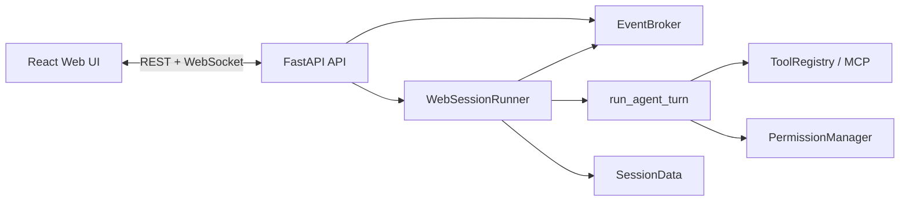

# MC-WEB-20260619 任务实现报告

| 项目 | 内容 |
|---|---|
| 任务 | 本地 Web 控制台 MVP |
| 目标版本 | `0.1.0-web-mvp` |
| 实施日期 | 2026-06-19 |
| 实施状态 | 已完成 |
| 依据 | `docs/DEVELOPMENT_GUIDELINES.md`、`docs/newTask/plan/WEB_UI_ONE_DAY_TASK_BRIEF_2026-06-19.md` |

## 1. 交付结论

本任务已交付可启动、可测试的本地 Web 产品面。FastAPI 服务固定监听 `127.0.0.1`，React 页面提供会话、对话、工具、权限、错误、Activity 与 Changes 三栏体验；窄屏下左右栏为覆盖式抽屉。Web 通过 callback 适配现有 `run_agent_turn()`，没有把 Agent 决策搬入前端，也没有改变 TUI 与 Headless 稳定入口。

启动命令：

```bash
python -m pip install -e '.[web]'
cd web && npm install && npm run build && cd ..
minicode-web
```

访问地址：`http://127.0.0.1:8765`。

## 2. 任务完成矩阵

| 编号 | 状态 | 实现 |
|---|---|---|
| WEB-001 | 完成 | 新增 `minicode/web/`、`web/`、Web 可选依赖与 `minicode-web` 入口。 |
| WEB-002 | 完成 | `WebEvent` 稳定信封；Broker 负责单调序号、历史、等待、断线重放与游标续接。 |
| WEB-003 | 完成 | Runner 将流式输出、工具、runtime phase、异常和权限 callback 映射为统一事件。 |
| WEB-004 | 完成 | 会话、消息、取消、Diff、权限 REST API 和 session WebSocket；统一错误信封。 |
| WEB-005 | 完成 | 桌面三栏布局、严格类型 Store、CSS variables 和移动端抽屉。 |
| WEB-006 | 完成 | 用户消息、`assistant.delta` 合并、最终回答和 reconnect 状态。 |
| WEB-007 | 完成 | 工具名称、输入/输出摘要、耗时、成功/失败卡片；`turn.failed` 错误卡片。 |
| WEB-008 | 完成 | 阻塞式审批协调器、批准/拒绝/超时、重复响应保护、按钮防连击。 |
| WEB-009 | 完成 | `SessionData` 持久化、页面刷新恢复、工具状态重建、只读 Git Diff。 |
| WEB-010 | 完成 | Python/前端测试、生产构建、浏览器验收和文档。 |

## 3. 架构实现



- `minicode/web/events.py`：稳定事件信封和首日事件类型。
- `minicode/web/broker.py`：线程安全序号、订阅、重放；服务重启后的 reconnect 游标继续单调递增。
- `minicode/web/runner.py`：单工作区单活跃 turn、Worker 生命周期、终态、callback、权限等待和持久化。
- `minicode/web/api.py` / `app.py`：API、WebSocket、OpenAPI、统一错误和静态资源。
- `minicode/web/security.py`：Key 名、Bearer、常见 Token/API Key 文本脱敏。
- `minicode/web/diff.py`：固定工作区内执行只读 Git 查询，包含 tracked 与 untracked 文本文件。
- `web/src/store/sessionStore.ts`：按 `seq` 幂等归并，终态以服务端为准，并从快照恢复工具状态。

## 4. 关键行为

### Runtime 与恢复

- 每个启动的 turn 由 `completed`、`failed` 或 `cancelled` 收口。
- 后台异常生成 `errorType` 与 `traceId`，完整堆栈写日志；`failed` 不被 finally 改回 `idle`。
- WebSocket 按最后 `seq` 重放；重复事件由 reducer 丢弃。
- 页面刷新从 `SessionData` 恢复用户/Assistant 消息、turn 终态和工具结果。
- 取消采用协作式取消，不强杀 Agent Worker。

### 权限与安全

- 写文件、危险命令和工作区外访问继续由 `PermissionManager` 判定。
- 浏览器只提交受限 decision，不传工具 schema 或自定义执行参数。
- 权限请求支持用户批准、拒绝、超时拒绝和重复响应冲突。
- 服务无 `0.0.0.0` 启动参数，无宽泛 CORS，前后端生产模式同源。
- Runtime 配置、API Key、Token 与完整环境变量不进入 API 或 WebSocket。
- WebSocket 为 server-push-only；客户端消息会以 `1003` 拒绝。

## 5. API 与页面

已实现任务书列出的全部端点：

```text
GET    /api/status
GET    /api/sessions
POST   /api/sessions
GET    /api/sessions/{session_id}
POST   /api/sessions/{session_id}/messages
POST   /api/sessions/{session_id}/cancel
GET    /api/sessions/{session_id}/diff
POST   /api/permissions/{request_id}/resolve
WS     /api/sessions/{session_id}/events?after={seq}
```

页面信息优先级为用户问题/最终回答、权限与错误、运行工具、已完成工具、Activity。长工具输出和 Diff 默认折叠；状态和连接均同时提供文字，不依赖颜色表达。

## 6. 文档与配置变更

- `pyproject.toml`：新增 `web` 可选依赖、dev API 测试依赖与 `minicode-web`。
- `README.md`、`README.zh-CN.md`：新增 Web 启动说明。
- `docs/STRUCTURE.md`：新增 Web 模块边界与职责。
- `docs/USAGE_GUIDE.md`：新增安装、启动、状态、安全与测试说明。
- `.gitignore`：忽略前端依赖与 TypeScript build metadata。

## 7. 范围说明

必须项全部实现。额外完成了取消端点、系统深浅色自动适配和移动端抽屉。仍保持一日 MVP 边界：不支持公网部署、多工作区/多 Agent 并行、在线代码编辑、PR 工作流和桌面封装。取消为协作式，已开始且不触发 callback 的阻塞型底层调用需要等待其自身超时。

测试明细见 `docs/newTask/test/MC-WEB-20260619_TEST_REPORT.md`。
